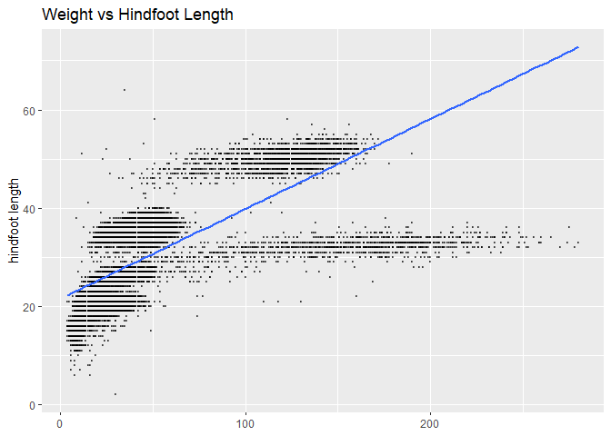
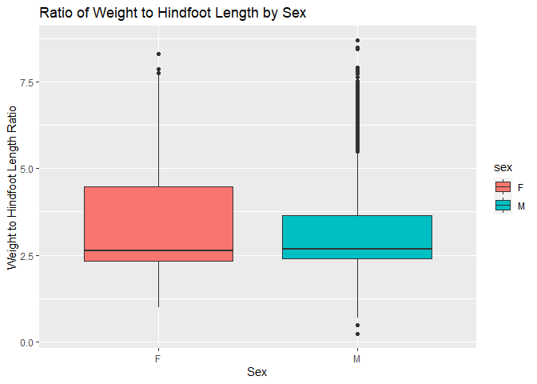

## Instructions
Answer the following questions and complete the exercises in RMarkdown. Please embed all of your code and push your final work to your repository. Your final lab report should be organized, clean, and run free from errors. Remember, you must remove the `#` for the included code chunks to run. Be sure to add your name to the author header above. For any included plots, make sure they are clearly labeled. You are free to use any plot type that you feel best communicates the results of your analysis.  

Make sure to use the formatting conventions of RMarkdown to make your report neat and clean!  

## Load the libraries

```r
library(tidyverse)
library(janitor)
library(here)
library(naniar)
```

## Desert Ecology
For this assignment, we are going to use a modified data set on [desert ecology](http://esapubs.org/archive/ecol/E090/118/). The data are from: S. K. Morgan Ernest, Thomas J. Valone, and James H. Brown. 2009. Long-term monitoring and experimental manipulation of a Chihuahuan Desert ecosystem near Portal, Arizona, USA. Ecology 90:1708.

```r
deserts <- read_csv(here("lab10", "data", "surveys_complete.csv"))
```

```
## 
## -- Column specification --------------------------------------------------------
## cols(
##   record_id = col_double(),
##   month = col_double(),
##   day = col_double(),
##   year = col_double(),
##   plot_id = col_double(),
##   species_id = col_character(),
##   sex = col_character(),
##   hindfoot_length = col_double(),
##   weight = col_double(),
##   genus = col_character(),
##   species = col_character(),
##   taxa = col_character(),
##   plot_type = col_character()
## )
```

1. Use the function(s) of your choice to get an idea of its structure, including how NA's are treated. Are the data tidy?  

```r
glimpse(deserts)
```

```
## Rows: 34,786
## Columns: 13
## $ record_id       <dbl> 1, 2, 3, 4, 5, 6, 7, 8, 9, 10, 11, 12, 13, 14, 15, ...
## $ month           <dbl> 7, 7, 7, 7, 7, 7, 7, 7, 7, 7, 7, 7, 7, 7, 7, 7, 7, ...
## $ day             <dbl> 16, 16, 16, 16, 16, 16, 16, 16, 16, 16, 16, 16, 16,...
## $ year            <dbl> 1977, 1977, 1977, 1977, 1977, 1977, 1977, 1977, 197...
## $ plot_id         <dbl> 2, 3, 2, 7, 3, 1, 2, 1, 1, 6, 5, 7, 3, 8, 6, 4, 3, ...
## $ species_id      <chr> "NL", "NL", "DM", "DM", "DM", "PF", "PE", "DM", "DM...
## $ sex             <chr> "M", "M", "F", "M", "M", "M", "F", "M", "F", "F", "...
## $ hindfoot_length <dbl> 32, 33, 37, 36, 35, 14, NA, 37, 34, 20, 53, 38, 35,...
## $ weight          <dbl> NA, NA, NA, NA, NA, NA, NA, NA, NA, NA, NA, NA, NA,...
## $ genus           <chr> "Neotoma", "Neotoma", "Dipodomys", "Dipodomys", "Di...
## $ species         <chr> "albigula", "albigula", "merriami", "merriami", "me...
## $ taxa            <chr> "Rodent", "Rodent", "Rodent", "Rodent", "Rodent", "...
## $ plot_type       <chr> "Control", "Long-term Krat Exclosure", "Control", "...
```

```r
naniar::miss_var_summary(deserts)
```

```
## # A tibble: 13 x 3
##    variable        n_miss pct_miss
##    <chr>            <int>    <dbl>
##  1 hindfoot_length   3348     9.62
##  2 weight            2503     7.20
##  3 sex               1748     5.03
##  4 record_id            0     0   
##  5 month                0     0   
##  6 day                  0     0   
##  7 year                 0     0   
##  8 plot_id              0     0   
##  9 species_id           0     0   
## 10 genus                0     0   
## 11 species              0     0   
## 12 taxa                 0     0   
## 13 plot_type            0     0
```

2. How many genera and species are represented in the data? What are the total number of observations? Which species is most/ least frequently sampled in the study?   
There are 26 genera and 40 species in 34,786 total observations. The most sampled is the Dipodomys merriami and the least sampled is the clarki/scutalatus/tereticaudus/viridis.

```r
deserts %>% 
  summarize(n_genera=n_distinct(genus),
            n_species=n_distinct(species),
            n_observations=n_distinct(record_id))
```

```
## # A tibble: 1 x 3
##   n_genera n_species n_observations
##      <int>     <int>          <int>
## 1       26        40          34786
```

```r
deserts %>% 
  count(genus,species) %>% 
  arrange(n)
```

```
## # A tibble: 48 x 3
##    genus           species          n
##    <chr>           <chr>        <int>
##  1 Cnemidophorus   tigris           1
##  2 Cnemidophorus   uniparens        1
##  3 Crotalus        scutalatus       1
##  4 Crotalus        viridis          1
##  5 Sceloporus      clarki           1
##  6 Spermophilus    tereticaudus     1
##  7 Ammodramus      savannarum       2
##  8 Reithrodontomys sp.              2
##  9 Zonotrichia     leucophrys       2
## 10 Lizard          sp.              4
## # ... with 38 more rows
```


```r
deserts %>% 
  count(genus,species) %>% 
  arrange(desc(n))
```

```
## # A tibble: 48 x 3
##    genus           species          n
##    <chr>           <chr>        <int>
##  1 Dipodomys       merriami     10596
##  2 Chaetodipus     penicillatus  3123
##  3 Dipodomys       ordii         3027
##  4 Chaetodipus     baileyi       2891
##  5 Reithrodontomys megalotis     2609
##  6 Dipodomys       spectabilis   2504
##  7 Onychomys       torridus      2249
##  8 Perognathus     flavus        1597
##  9 Peromyscus      eremicus      1299
## 10 Neotoma         albigula      1252
## # ... with 38 more rows
```

3. What is the proportion of taxa included in this study? Show a table and plot that reflects this count.

```r
deserts %>% 
  count(taxa)
```

```
## # A tibble: 4 x 2
##   taxa        n
## * <chr>   <int>
## 1 Bird      450
## 2 Rabbit     75
## 3 Reptile    14
## 4 Rodent  34247
```

```r
deserts %>% 
  ggplot(aes(x = taxa))+
  geom_bar()+
  labs(title="Number and Proportion of Taxa")
```

<!-- -->

4. For the taxa included in the study, use the fill option to show the proportion of individuals sampled by `plot_type.`

```r
deserts %>% 
  ggplot(aes(x = taxa, fill=plot_type))+
  geom_bar()+
  labs(title="Number and Proportion of Taxa, Seen by Type of Plot")
```

<!-- -->

5. What is the range of weight for each species included in the study? Remove any observations of weight that are NA so they do not show up in the plot.

```r
deserts %>% 
  ggplot(aes(x=species, y=weight))+
  geom_boxplot(na.rm = T) +
  theme(axis.text.x = element_text(angle = 60, hjust=1))+
  labs(title="Range of Weights by Species")
```

<!-- -->
<style>
div.blue { background-color:#e6f0ff; border-radius: 5px; padding: 20px;}
</style>
<div class = "blue">

6. Add another layer to your answer from #5 using `geom_point` to get an idea of how many measurements were taken for each species.

```r
deserts_counts <- deserts %>% 
  count(species)
deserts_counts
```

```
## # A tibble: 40 x 2
##    species             n
##  * <chr>           <int>
##  1 albigula         1252
##  2 audubonii          75
##  3 baileyi          2891
##  4 bilineata         303
##  5 brunneicapillus    50
##  6 chlorurus          39
##  7 clarki              1
##  8 eremicus         1299
##  9 flavus           1597
## 10 fulvescens         75
## # ... with 30 more rows
```


```r
deserts_counts %>% 
  ggplot(aes(x=species, y=n))+
  geom_point(na.rm = T) +
  theme(axis.text.x = element_text(angle = 60, hjust=1))+
  labs(title="Observations per Species")
```

<!-- -->
</div>

7. [Dipodomys merriami](https://en.wikipedia.org/wiki/Merriam's_kangaroo_rat) is the most frequently sampled animal in the study. How have the number of observations of this species changed over the years included in the study?

```r
deserts %>% 
  filter(species=="merriami") %>% 
  ggplot(aes(x=year)) +
  geom_bar()+
  labs(title="Dipodomys merriami Observations Over Time")
```

<!-- -->

8. What is the relationship between `weight` and `hindfoot` length? Consider whether or not over plotting is an issue.

```r
deserts %>% 
  ggplot(aes(x=weight, y=hindfoot_length))+
  geom_point(na.rm=T, alpha=0.5, size=0.25)+
  geom_smooth(na.rm=T, method=lm, se=F)+
  labs(title="Weight vs Hindfoot Length",
       x=NULL,
       y="hindfoot length")
```

```
## `geom_smooth()` using formula 'y ~ x'
```

<!-- -->
<style>
div.blue { background-color:#e6f0ff; border-radius: 5px; padding: 20px;}
</style>
<div class = "blue">

9. Which two species have, on average, the highest weight? Once you have identified them, make a new column that is a ratio of `weight` to `hindfoot_length`. Make a plot that shows the range of this new ratio and fill by sex.

```r
deserts %>% 
  group_by(genus, species) %>% 
  summarize(avg_weight=mean(weight, na.rm = T)) %>% 
  arrange(desc(avg_weight))
```

```
## `summarise()` has grouped output by 'genus'. You can override using the `.groups` argument.
```

```
## # A tibble: 48 x 3
## # Groups:   genus [26]
##    genus        species      avg_weight
##    <chr>        <chr>             <dbl>
##  1 Neotoma      albigula          159. 
##  2 Dipodomys    spectabilis       120. 
##  3 Spermophilus spilosoma          93.5
##  4 Sigmodon     hispidus           73.1
##  5 Sigmodon     fulviventer        58.9
##  6 Sigmodon     ochrognathus       55.4
##  7 Dipodomys    ordii              48.9
##  8 Dipodomys    merriami           43.2
##  9 Chaetodipus  baileyi            31.7
## 10 Onychomys    leucogaster        31.6
## # ... with 38 more rows
```

```r
deserts_chunk <- deserts %>% 
  filter(species=="albigula"|species=="spectabilis") %>% 
  mutate(weight_length_ratio=weight/hindfoot_length)
deserts_chunk
```

```
## # A tibble: 3,756 x 14
##    record_id month   day  year plot_id species_id sex   hindfoot_length weight
##        <dbl> <dbl> <dbl> <dbl>   <dbl> <chr>      <chr>           <dbl>  <dbl>
##  1         1     7    16  1977       2 NL         M                  32     NA
##  2         2     7    16  1977       3 NL         M                  33     NA
##  3        11     7    16  1977       5 DS         F                  53     NA
##  4        17     7    16  1977       3 DS         F                  48     NA
##  5        20     7    17  1977      11 DS         F                  48     NA
##  6        22     7    17  1977      15 NL         F                  31     NA
##  7        30     7    17  1977      10 DS         F                  52     NA
##  8        38     7    17  1977      17 NL         M                  33     NA
##  9        42     7    18  1977      18 DS         F                  46     NA
## 10        58     7    18  1977      12 DS         M                  45     NA
## # ... with 3,746 more rows, and 5 more variables: genus <chr>, species <chr>,
## #   taxa <chr>, plot_type <chr>, weight_length_ratio <dbl>
```

```r
deserts_chunk %>% 
  filter(sex!="NA") %>% 
  ggplot(aes(x=sex,y=weight_length_ratio, fill=sex))+
  geom_boxplot(na.rm = T)+
  labs(title = "Ratio of Weight to Hindfoot Length by Sex",
       x="Sex",
       y="Weight to Hindfoot Length Ratio")
```

<!-- -->
</div>

10. Make one plot of your choice! Make sure to include at least two of the aesthetics options you have learned.

```r
ordii_means <- deserts %>% 
  filter(species=="ordii", sex!="NA") %>% 
  group_by(year, sex) %>% 
  summarise(avg_hindfoot=mean(hindfoot_length, na.rm = T))
```

```
## `summarise()` has grouped output by 'year'. You can override using the `.groups` argument.
```

```r
ordii_means
```

```
## # A tibble: 52 x 3
## # Groups:   year [26]
##     year sex   avg_hindfoot
##    <dbl> <chr>        <dbl>
##  1  1977 F             33.6
##  2  1977 M             33  
##  3  1978 F             32.6
##  4  1978 M             34.6
##  5  1979 F             33.6
##  6  1979 M             34.5
##  7  1980 F             35  
##  8  1980 M             34.5
##  9  1981 F             36.1
## 10  1981 M             35.6
## # ... with 42 more rows
```

```r
ordii_means %>% 
  ggplot(aes(x=year,y=avg_hindfoot, color=sex, shape=sex, size=.5))+
  geom_point(na.rm = T)+
  labs(title="Average Hindfoot Length in Ordii",
       x="Year",
       y="Average Hindfoot Length")
```

<!-- -->


## Push your final code to GitHub!
Please be sure that you check the `keep md` file in the knit preferences. 
