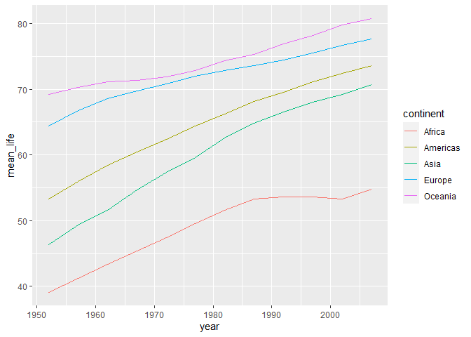
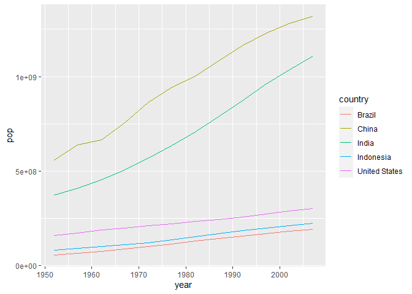

## Instructions
Answer the following questions and complete the exercises in RMarkdown. Please embed all of your code and push your final work to your repository. Your final lab report should be organized, clean, and run free from errors. Remember, you must remove the `#` for the included code chunks to run. Be sure to add your name to the author header above. For any included plots, make sure they are clearly labeled. You are free to use any plot type that you feel best communicates the results of your analysis.  

**In this homework, you should make use of the aesthetics you have learned. It's OK to be flashy!**

Make sure to use the formatting conventions of RMarkdown to make your report neat and clean!  

## Load the libraries

```r
library(tidyverse)
library(janitor)
library(here)
library(naniar)
```

## Resources
The idea for this assignment came from [Rebecca Barter's](http://www.rebeccabarter.com/blog/2017-11-17-ggplot2_tutorial/) ggplot tutorial so if you get stuck this is a good place to have a look.  

## Gapminder
For this assignment, we are going to use the dataset [gapminder](https://cran.r-project.org/web/packages/gapminder/index.html). Gapminder includes information about economics, population, and life expectancy from countries all over the world. You will need to install it before use. This is the same data that we will use for midterm 2 so this is good practice.

```r
#install.packages("gapminder")
library("gapminder")
```

## Questions
The questions below are open-ended and have many possible solutions. Your approach should, where appropriate, include numerical summaries and visuals. Be creative; assume you are building an analysis that you would ultimately present to an audience of stakeholders. Feel free to try out different `geoms` if they more clearly present your results.  

**1. Use the function(s) of your choice to get an idea of the overall structure of the data frame, including its dimensions, column names, variable classes, etc. As part of this, determine how NA's are treated in the data.**  

```r
glimpse(gapminder)
```

```
## Rows: 1,704
## Columns: 6
## $ country   <fct> Afghanistan, Afghanistan, Afghanistan, Afghanistan, Afgha...
## $ continent <fct> Asia, Asia, Asia, Asia, Asia, Asia, Asia, Asia, Asia, Asi...
## $ year      <int> 1952, 1957, 1962, 1967, 1972, 1977, 1982, 1987, 1992, 199...
## $ lifeExp   <dbl> 28.801, 30.332, 31.997, 34.020, 36.088, 38.438, 39.854, 4...
## $ pop       <int> 8425333, 9240934, 10267083, 11537966, 13079460, 14880372,...
## $ gdpPercap <dbl> 779.4453, 820.8530, 853.1007, 836.1971, 739.9811, 786.113...
```

```r
naniar::miss_var_summary(gapminder)
```

```
## # A tibble: 6 x 3
##   variable  n_miss pct_miss
##   <chr>      <int>    <dbl>
## 1 country        0        0
## 2 continent      0        0
## 3 year           0        0
## 4 lifeExp        0        0
## 5 pop            0        0
## 6 gdpPercap      0        0
```

**2. Among the interesting variables in gapminder is life expectancy. How has global life expectancy changed between 1952 and 2007?**

```r
gapminder_life <- gapminder %>% 
  group_by(year) %>% 
  summarise(mean_life = mean(lifeExp))
gapminder_life
```

```
## # A tibble: 12 x 2
##     year mean_life
##  * <int>     <dbl>
##  1  1952      49.1
##  2  1957      51.5
##  3  1962      53.6
##  4  1967      55.7
##  5  1972      57.6
##  6  1977      59.6
##  7  1982      61.5
##  8  1987      63.2
##  9  1992      64.2
## 10  1997      65.0
## 11  2002      65.7
## 12  2007      67.0
```


```r
gapminder_life %>% 
  filter(year>=1952, year<=2007) %>%
  ggplot(aes(x=year,y=mean_life)) +
  geom_line() +
  labs(title = "Global Life Expectancy between 1952 and 2007")
```

<!-- -->

**3. How do the distributions of life expectancy compare for the years 1952 and 2007?**

```r
gapminder %>% 
  filter(year==1952 | year==2007) %>%
  ggplot(aes(x=year,y=lifeExp, group=year)) +
  geom_boxplot() +
  labs(title = "Global Life Expectancy in 1952 and 2007")
```

<!-- -->

**4. Your answer above doesn't tell the whole story since life expectancy varies by region. Make a summary that shows the min, mean, and max life expectancy by continent for all years represented in the data.**

```r
gapminder %>% 
  group_by(year, continent) %>% 
  summarise(min_life=min(lifeExp),
            mean_life=mean(lifeExp),
            max_life=max(lifeExp))
```

```
## `summarise()` has grouped output by 'year'. You can override using the `.groups` argument.
```

```
## # A tibble: 60 x 5
## # Groups:   year [12]
##     year continent min_life mean_life max_life
##    <int> <fct>        <dbl>     <dbl>    <dbl>
##  1  1952 Africa        30        39.1     52.7
##  2  1952 Americas      37.6      53.3     68.8
##  3  1952 Asia          28.8      46.3     65.4
##  4  1952 Europe        43.6      64.4     72.7
##  5  1952 Oceania       69.1      69.3     69.4
##  6  1957 Africa        31.6      41.3     58.1
##  7  1957 Americas      40.7      56.0     70.0
##  8  1957 Asia          30.3      49.3     67.8
##  9  1957 Europe        48.1      66.7     73.5
## 10  1957 Oceania       70.3      70.3     70.3
## # ... with 50 more rows
```

**5. How has life expectancy changed between 1952-2007 for each continent?**

```r
gapminder_life_countries <- gapminder %>% 
  group_by(year, continent) %>% 
  summarise(mean_life=mean(lifeExp))
```

```
## `summarise()` has grouped output by 'year'. You can override using the `.groups` argument.
```

```r
gapminder_life_countries
```

```
## # A tibble: 60 x 3
## # Groups:   year [12]
##     year continent mean_life
##    <int> <fct>         <dbl>
##  1  1952 Africa         39.1
##  2  1952 Americas       53.3
##  3  1952 Asia           46.3
##  4  1952 Europe         64.4
##  5  1952 Oceania        69.3
##  6  1957 Africa         41.3
##  7  1957 Americas       56.0
##  8  1957 Asia           49.3
##  9  1957 Europe         66.7
## 10  1957 Oceania        70.3
## # ... with 50 more rows
```


```r
gapminder_life_countries %>% 
  ggplot(aes(x=year,y=mean_life, color=continent)) +
  geom_line()
```

<!-- -->


**6. We are interested in the relationship between per capita GDP and life expectancy; i.e. does having more money help you live longer?**

```r
gapminder %>% 
  ggplot(aes(x=gdpPercap,y=lifeExp))+
  geom_point(alpha=.25)
```

<!-- -->


**7. Which countries have had the largest population growth since 1952?**

```r
gapminder_pop <- gapminder %>% 
  filter(year==1952|year==2007) %>%
  group_by(country) %>% 
  summarize(min=min(pop),
            max=max(pop))
gapminder_pop
```

```
## # A tibble: 142 x 3
##    country          min       max
##  * <fct>          <int>     <int>
##  1 Afghanistan  8425333  31889923
##  2 Albania      1282697   3600523
##  3 Algeria      9279525  33333216
##  4 Angola       4232095  12420476
##  5 Argentina   17876956  40301927
##  6 Australia    8691212  20434176
##  7 Austria      6927772   8199783
##  8 Bahrain       120447    708573
##  9 Bangladesh  46886859 150448339
## 10 Belgium      8730405  10392226
## # ... with 132 more rows
```

```r
gapminder_pop %>% 
  mutate(pop_growth = max-min) %>% 
  arrange(desc(pop_growth))
```

```
## # A tibble: 142 x 4
##    country             min        max pop_growth
##    <fct>             <int>      <int>      <int>
##  1 China         556263527 1318683096  762419569
##  2 India         372000000 1110396331  738396331
##  3 United States 157553000  301139947  143586947
##  4 Indonesia      82052000  223547000  141495000
##  5 Brazil         56602560  190010647  133408087
##  6 Pakistan       41346560  169270617  127924057
##  7 Bangladesh     46886859  150448339  103561480
##  8 Nigeria        33119096  135031164  101912068
##  9 Mexico         30144317  108700891   78556574
## 10 Philippines    22438691   91077287   68638596
## # ... with 132 more rows
```

**8. Use your results from the question above to plot population growth for the top five countries since 1952.**

```r
gapminder %>% 
  filter(country=="China"|country=="India"|country=="United States"|country=="Indonesia"|country=="Brazil") %>% 
  ggplot(aes(x=year,y=pop, color=country))+
  geom_line()
```

<!-- -->

**9. How does per-capita GDP growth compare between these same five countries?**

```r
gapminder %>% 
  filter(country=="China"|country=="India"|country=="United States"|country=="Indonesia"|country=="Brazil") %>% 
  ggplot(aes(x=year,y=gdpPercap, color=country))+
  geom_line()
```

<!-- -->

**10. Make one plot of your choice that uses faceting!**

```r
gapminder %>% 
  ggplot(aes(x=year,y=pop, fill=continent))+
  geom_col()+
  facet_wrap(~continent)
```

<!-- -->

## Push your final code to GitHub!
Please be sure that you check the `keep md` file in the knit preferences. 
